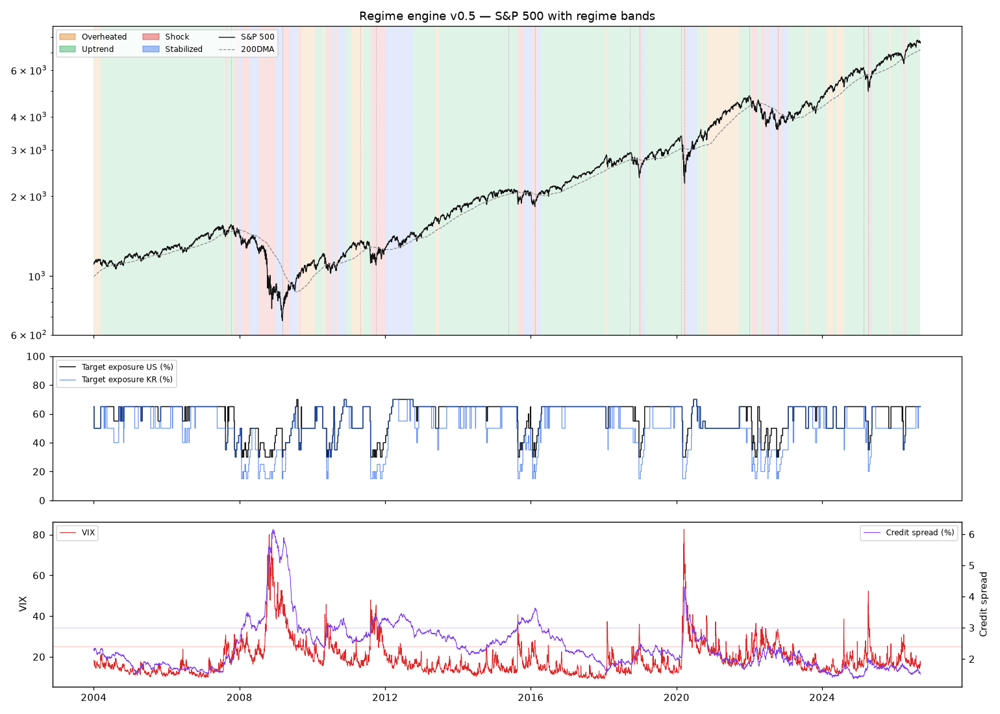

# 백테스트 점검 — 엔진 v0.5
기간 2004-01-02 ~ 2026-09-11 (22.7년) · 데이터: live · 신용 스프레드(baa10y) 커버리지 100% (첫 값 2004-01-02)

목적은 수익률이 아니라 **규칙이 상식적으로 움직였는지** 확인하는 것입니다.

## 점검 1·2. 위기별: 언제 줄였고, 언제 다시 늘렸나

| 위기 | 고점 | S&P 최대낙폭 | 고점 시 노출 | 첫 충격 판정 | 고점→충격 (일) | 충격 시 S&P 낙폭 | 구간 최소 노출 | 바닥 | 바닥 시 노출 | 바닥+60일 노출(국면) | 노출 반영 낙폭 |
|---|---|---|---|---|---|---|---|---|---|---|---|
| 2008 금융위기 | 2007-10-09 | -57% | 65% | 2007-11-12 | 24 | -8% | 30% (2007-11-20) | 2009-03-09 | 30% | 50% (안정화 침체) | -30% |
| 2011 유로 위기 | 2011-04-29 | -19% | 50% | 2011-08-08 | 69 | -18% | 30% (2011-08-09) | 2011-10-03 | 30% | 40% (충격 진행) | -11% |
| 2015-16 중국/유가 | 2015-05-21 | -14% | 65% | 2015-08-24 | 65 | -11% | 30% (2015-08-26) | 2016-02-11 | 30% | 65% (일반 상승) | -10% |
| 2018 4분기 | 2018-09-20 | -20% | 65% | 2018-12-20 | 63 | -16% | 30% (2018-12-20) | 2018-12-24 | 30% | 65% (일반 상승) | -11% |
| 2020 코로나 | 2020-02-19 | -34% | 65% | 2020-03-03 | 9 | -11% | 30% (2020-03-03) | 2020-03-23 | 30% | 65% (안정화 침체) | -14% |
| 2022 긴축 | 2022-01-03 | -25% | 65% | 2022-01-26 | 16 | -9% | 30% (2022-02-28) | 2022-10-12 | 35% | 50% (안정화 침체) | -16% |
| 2025 관세 충격 | 2025-02-19 | -19% | 65% | 2025-04-07 | 33 | -18% | 35% (2025-04-07) | 2025-04-08 | 35% | 65% (일반 상승) | -11% |

읽는 법: '고점→충격'이 짧고 '충격 시 낙폭'이 작을수록 일찍 줄인 것. '바닥+60일 노출'이 바닥 시점보다 높으면 바닥 근처에서 다시 늘린 것. '노출 반영 낙폭'은 목표 노출대로 S&P를 들고 있었을 때의 구간 낙폭(단순 참고).

## 점검 3. 왔다갔다

- 국면 전환 78회 / 22.7년 = **연 3.4회**
- 충격 판정 19회, 그중 10일 미만 짧은 충격 **0회**
- 국면 비중: 일반 상승 63% · 안정화 침체 13% · 충격 진행 12% · 과열 상승 11%
- 평균 목표 노출 58%

## 점검 4. 동결(VIX 급등 경보)은 얼마나 맞았나

- 동결 30회: 15일 안에 충격으로 이어짐 **7회**, 경보만으로 끝남 **11회**, 이미 충격 중 12회
- 동결의 비용은 '며칠간 신규 매수 안 함' 뿐이므로, 경보만으로 끝난 횟수가 많아도 규칙을 바꿀 이유는 아닙니다.

| 동결 시작 | 끝 | 일수 | 결과 |
|---|---|---|---|
| 2007-08-15 | 2007-08-22 | 6 | 이미 충격 |
| 2007-11-12 | 2007-11-16 | 5 | 이미 충격 |
| 2008-01-22 | 2008-01-28 | 5 | 이미 충격 |
| 2008-03-14 | 2008-03-24 | 6 | 이미 충격 |
| 2008-09-15 | 2009-06-10 | 186 | 이미 충격 |
| 2009-06-15 | 2009-06-29 | 11 | 해제(경보만) |
| 2009-07-07 | 2009-07-14 | 6 | 해제(경보만) |
| 2009-10-30 | 2009-11-05 | 5 | 해제(경보만) |
| 2010-05-06 | 2010-06-16 | 29 | 충격으로 이어짐 |
| 2010-06-29 | 2010-07-09 | 8 | 이미 충격 |
| 2011-08-04 | 2011-12-05 | 86 | 충격으로 이어짐 |
| 2011-12-08 | 2011-12-14 | 5 | 이미 충격 |
| 2015-08-24 | 2015-09-08 | 11 | 이미 충격 |
| 2018-02-05 | 2018-02-14 | 8 | 해제(경보만) |
| 2018-12-21 | 2019-01-02 | 7 | 이미 충격 |
| 2020-02-27 | 2020-05-26 | 62 | 충격으로 이어짐 |
| 2020-06-11 | 2020-07-07 | 18 | 해제(경보만) |
| 2020-07-13 | 2020-07-17 | 5 | 해제(경보만) |
| 2020-09-03 | 2020-09-14 | 7 | 해제(경보만) |
| 2020-10-26 | 2020-11-09 | 11 | 해제(경보만) |
| 2021-01-27 | 2021-02-05 | 8 | 해제(경보만) |
| 2021-12-01 | 2021-12-09 | 7 | 해제(경보만) |
| 2022-01-25 | 2022-02-02 | 7 | 충격으로 이어짐 |
| 2022-02-23 | 2022-03-18 | 18 | 이미 충격 |
| 2022-04-26 | 2022-05-24 | 21 | 이미 충격 |
| 2022-06-13 | 2022-06-27 | 10 | 충격으로 이어짐 |
| 2022-09-26 | 2022-10-25 | 22 | 충격으로 이어짐 |
| 2024-08-05 | 2024-08-09 | 5 | 해제(경보만) |
| 2025-04-03 | 2025-04-28 | 17 | 충격으로 이어짐 |
| 2026-03-27 | 2026-04-06 | 6 | 이미 충격 |

## 점검 5. 취약도 점수(참고)는 실제로 앞섰나

| 위기 | 고점 당일 점수 | 고점 전 60일 최대 | 켜진 것 |
|---|---|---|---|
| 2008 금융위기 | 2 | 2 | 폭·금리 |
| 2011 유로 위기 | 0 | 0 | 없음 |
| 2015-16 중국/유가 | 1 | 1 | 신용 |
| 2018 4분기 | 0 | 1 | 폭 |
| 2020 코로나 | 2 | 2 | 폭·금리 |
| 2022 긴축 | 1 | 2 | 폭·신용 |
| 2025 관세 충격 | 2 | 2 | 폭·금리 |

- 충격이 아닌 날 중 60거래일 안에 충격이 온 비율(기저율): **19%**
- 취약도 ≥1 인 날 (1761일) 중 60일 안 충격: **23%**
- 취약도 ≥2 인 날 (309일) 중 60일 안 충격: **24%**
- 취약도 ≥3 인 날 (1일) 중 60일 안 충격: **0%**
  - 시장 폭 단독 (496일): 22%
  - 신용 엇갈림 단독 (63일): 19%
  - 금리 역전 단독 (1512일): 24%
- 읽는 법: 점수≥2 의 확률이 기저율보다 뚜렷이 높아야 '앞선다'고 볼 수 있음. 비슷하면 참고 패널에서도 빼는 게 맞음.

## 충격 판정 전체 목록

| 시작 | 끝 | 일수 |
|---|---|---|
| 2007-08-15 | 2007-09-05 | 15 |
| 2007-11-12 | 2007-12-21 | 29 |
| 2008-01-22 | 2008-04-04 | 52 |
| 2008-07-09 | 2008-12-22 | 117 |
| 2009-03-05 | 2009-05-18 | 52 |
| 2009-08-20 | 2009-09-10 | 15 |
| 2010-05-24 | 2010-07-13 | 35 |
| 2010-08-13 | 2010-09-07 | 17 |
| 2011-08-08 | 2012-01-05 | 105 |
| 2015-08-24 | 2015-10-23 | 44 |
| 2016-01-19 | 2016-03-01 | 30 |
| 2018-12-20 | 2019-01-22 | 21 |
| 2020-03-03 | 2020-04-08 | 27 |
| 2022-01-26 | 2022-03-21 | 38 |
| 2022-04-26 | 2022-06-06 | 29 |
| 2022-07-05 | 2022-07-25 | 15 |
| 2022-09-30 | 2022-11-15 | 33 |
| 2025-04-07 | 2025-04-28 | 15 |
| 2026-03-24 | 2026-04-14 | 15 |

## 다음 판단거리

1. 짧은 충격이 많으면 → min_shock_days 나 smoothing_days 를 늘린다 (단, 빠른 위기 대응은 늦어진다).
2. 충격이 늦으면 → shock_score(1.5) 나 HY 기준(5.0)을 낮춘다. VIX 급등은 동결(경보)만 걸고 국면은 바꾸지 않는다.
3. 바닥 후 노출 회복이 느리면 → ladder_days_per_step 을 줄인다.
4. 기준을 바꿨으면 CHANGELOG.md 에 이유를 적고 다시 돌려 세 점검을 반복한다.